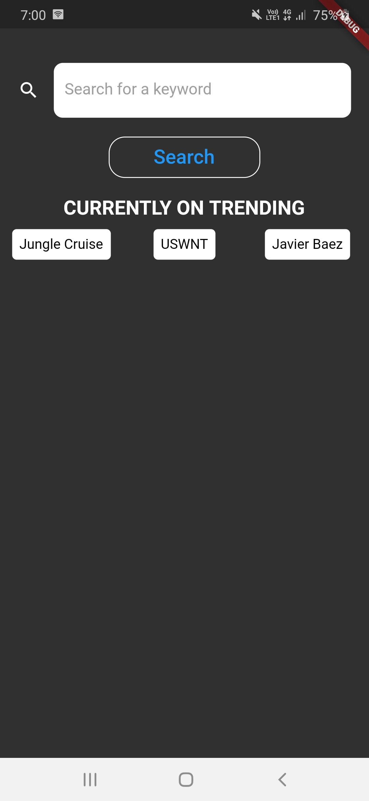
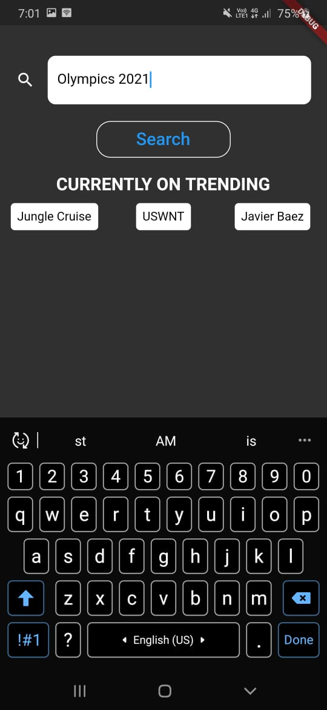
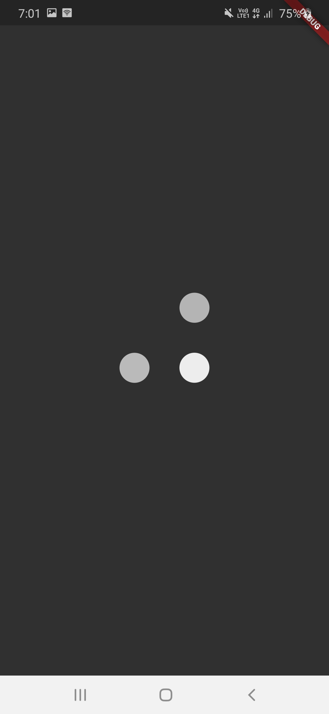

# Trends Rest API

#### Description
Created a RESTFUL API, for the most searched keywords. The data for the current trending words is then feteched from this API and displayed onto the screen, as shown below. Apart from that, a NEWS API was also integrated alongwith, to get a brief idea about the words on trending. 

## Snapshots of the created application, are attached below.

&nbsp;&nbsp;&nbsp;&nbsp;&nbsp;&nbsp;&nbsp;&nbsp;&nbsp;&nbsp;&nbsp;&nbsp;&nbsp;&nbsp;&nbsp;&nbsp;&nbsp;&nbsp;&nbsp;&nbsp;

       